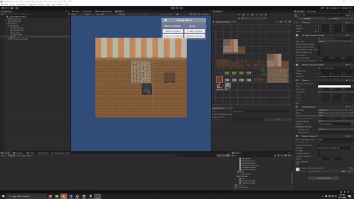

# Runtime Tile Controller

This is some code I've written for a mobile game I'm working on. I left the controls mouse based because I plan on implementing it more specifically in my own project to better work thematically.

>The tiles used are part of Shubibubi's free `Cozy Interior` asset pack on [itch.io](https://shubibubi.itch.io/cozy-interior). If you like it consider supporting them or checking out their other stuff.
https://shubibubi.itch.io/cozy-interior

## Plugins Used
- [Odin Inspector and Serializer](https://assetstore.unity.com/packages/tools/utilities/odin-inspector-and-serializer-89041)

- [Easy Save - The Complete Save Data & Serializer System](https://assetstore.unity.com/packages/tools/utilities/easy-save-the-complete-save-data-serializer-system-768)

## How it works
Using the Unity Tilemap you can setup and draw out your `Walls`, `Floors`, `Furniture`, and `Devices`. 

> Note: I have a scene that has a lot of my functional testing setup and you can use it to become familiar with how to use it.

### TilemapManager

Dropping the `TilemapManager` into the Grid that holds the Tilemaps you can then start defining out what each tilemap is. 

### TileRoomProperty

This defines if the tilemap object is a `Floor` or `Wall`, allowing for the TilemapObject to Identify it. 

### TilemapObject

Here you can define all of the Tile Object's Properties that include:

- What type of Object is it?
    
    - Furniture/Device

- If it can be placed on the Floor/Wall
- If it's allowed to be placed under Furniture (used for Furniture Objects Ideally)
- Should be treated as though it Has Collision
- The placement offset 
    - There may be a better way to do this, but the Tilemaps don't always align correctly due to their inconsistent shape. You can make slight adjustments to objects to fix this.
- Minor Adjustment Increment (For the Minor Adjustment Movement mode)

### TilemapSaveData & TilemapSaveManager
I used EasySave3 for the saving implementation, but you can use whatever you see fit. 

TileSaveData will store `PrefabName`, `Position`, and a randomly generated `UniqueID`. Allowing for saving and loading usage.

In order for this to work you need to make sure you add the prefabs that are capable of being saved into the TileSaveManager